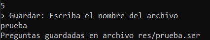

# Sistema de preguntas y puntajes

## AUTOR
JuanSebastián Díaz Salamanca [Juandiaz960](https://github.com/juandiaz960)

## PRE-REQUISITOS

* Java jdk > 7
* Git

## BUILT

* [JAVA JDK 8](http://www.oracle.com/technetwork/java/javase/overview/index.html) - Building
* [JUnit 3.8.1](https://mvnrepository.com/artifact/junit/junit/3.8.1) - Test

## COMENZANDO

Guarde una copia del repositorio mediante git clone:
```
git clone https://github.com/juandiaz960/DEVCO-Assessment
```

Puede ejecutar el proyecto desde su IDE preferido o desde consola en la carpeta donde guardó:
```
javac -d bin -sourcepath src src\main\java\devco\assessment\ScoreApplication.java && java -classpath bin main.java.devco.assessment.ScoreApplication
```

## PROYECTO

Esta aplicación permite realizar un test basado en preguntas que un usuario administrador puede definir, cargar y guardar mediante archivos serializables. Los usuarios aspirantes pueden resolver las preguntas previamente cargadas y sus resultados son almacenados dentro de un archivo que va creciendo a medida que más aspirantes realicen las pruebas. El proyecto viene con dos archivos extra en la carpeta /res, que son los archivos de pruebas de preguntas llamado "test" y el archivo de resultados llamado "records". **IMPORTANTE NO BORRAR** el archivo records.

### Funcionamiento

Al ejecutar el proyecto, se muestra por consola un menú que permite acceder a un usuario ADMIN o Aspirante. 


La clave del usuario ADMIN es **0000**. Al ingresar este código, permite realizar acciones como agregar preguntas, ver los resultados de los aspirantes o cargar preguntas desde archivos.


El usuario ADMIN puede agregar preguntas desde la opción 1, ver resultados con la opción 2 o cargar preguntas desde archivos con la opción 3. Para cargar archivos, sólo se debe escribir el nombre del archivo sin la extensión y debe estar guardado en la carpeta /res. Igualmente, al agregar preguntas, se puede escoger la opción de guardar las preguntas insertadas en un archivo, darle un nombre y quedará allí guardado en la carpeta /res.

* Agregar preguntas


* Guardar preguntas


* Cargar preguntas


* Ver resultados


Los usuarios Aspirante pueden resolver las preguntas creadas o cargadas. Al ingresar, pedirá un nombre para el registro y luego podrá resolver las preguntas. Al final se mostrará un mensaje validando el resultado.


* Final de prueba

